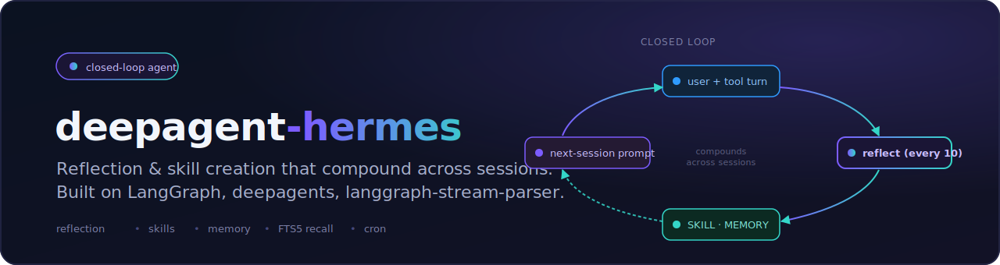

<p align="center">
  
</p>

# langstage-hermes

[](https://pypi.org/project/langstage-hermes/)
[](https://pypi.org/project/langstage-hermes/)
[](./LICENSE)

A faithful reproduction of [Nous Research's Hermes Agent](https://github.com/nousresearch/hermes-agent) on top of LangGraph + [`deepagents`](https://github.com/langchain-ai/deepagents) + [`langgraph-stream-parser`](https://github.com/dkedar7/langgraph-stream-parser).

**Status: live on PyPI** (renamed from `deepagent-hermes` — the old name now just installs this one, and the `deepagent-hermes` command still works). Spec at [SPEC.md](./SPEC.md). Release notes in [CHANGELOG.md](./CHANGELOG.md). The runtime is verified end-to-end against a real Anthropic model — both the memory loop and the skill-creation loop close autonomously; see [`examples/dogfood.py`](./examples/dogfood.py) and [`examples/dogfood_procedural.py`](./examples/dogfood_procedural.py) for the traces.

## What it is

A `deepagents`-built agent with a **closed reflection→skill-creation loop**:

- After ~10 tool-using iterations, a review subagent runs in the background, writes/patches a `SKILL.md` capturing the pattern it just exercised, and ships it to a skill library.
- Next session, the agent reads the library at startup, sees the new skill's description in its system prompt, and can `skill_view(name)` to load the full body on demand (progressive disclosure per the [agentskills.io spec](https://agentskills.io/specification.md)).
- A weekly **curator** consolidates skills into umbrellas and archives stale ones.
- A **frozen-snapshot memory** (`MEMORY.md` + `USER.md`) preserves prefix-cache hits for the entire session.
- **FTS5 session search** indexes every past conversation in a local SQLite DB.
- Bundled **MarkdownProvider** that keyword-searches `<HERMES_HOME>/memories/notes/*.md` — drop hand-authored long-form context there and the agent surfaces relevant sections on demand. Zero external dependencies.

Designed to be loaded into the LangStage host family without UI changes — set `LANGSTAGE_AGENT_SPEC=langstage_hermes.agent:graph` in any of them.

## Every stage for your LangGraph agent

langstage-hermes is the reference agent of the **LangStage family**: write your agent once — any LangGraph `CompiledGraph` — and run it on every stage with the same spec string (`module:attr` or `path/to/file.py:attr`), the same `langstage.toml` config file, and the same `LANGSTAGE_*` environment variables.

| Stage | Package | Try it |
|---|---|---|
| Web app | [langstage](https://github.com/dkedar7/langstage) | `langstage run --agent langstage_hermes.agent:graph` |
| JupyterLab | [langstage-jupyter](https://github.com/dkedar7/langstage-jupyter) | `pip install langstage-jupyter`, then the chat sidebar in `jupyter lab` |
| Terminal | [langstage-cli](https://github.com/dkedar7/langstage-cli) | `langstage-cli -a langstage_hermes.agent:graph` |
| VS Code | [langstage-vscode](https://github.com/dkedar7/langstage-vscode) | chat participant + stdio sidecar |
| Reference agent | langstage-hermes | **you are here** |
| Shared core | [langgraph-stream-parser](https://github.com/dkedar7/langgraph-stream-parser) | typed events + config resolver behind every stage |

### Serve over AG-UI

This surface's agent — any LangGraph `CompiledGraph` — can also be served over the [AG-UI protocol](https://github.com/dkedar7/langgraph-stream-parser). Install the extra and point the bundled console script at your agent spec:

```bash
pip install "langgraph-stream-parser[agui]"
langstage-agui --agent langstage_hermes.agent:graph
```

📖 **Full documentation:** <https://dkedar7.github.io/langstage-docs/>

## Installation

```bash
pip install langstage-hermes
```

Or with `uv` (recommended):

```bash
uv venv .venv
. .venv/Scripts/activate      # Windows
. .venv/bin/activate          # macOS / Linux
uv pip install langstage-hermes
```

### Optional extras

```bash
pip install "langstage-hermes[openai]"     # OpenAI / OpenRouter / any OpenAI-wire provider
pip install "langstage-hermes[daytona]"    # Daytona sandbox terminal backend
pip install "langstage-hermes[modal]"      # Modal sandbox terminal backend
pip install "langstage-hermes[ssh]"        # paramiko-backed SSH terminal backend
pip install "langstage-hermes[dev]"        # tests + lint (contributors only)
```

## Picking a model

By default the agent uses `anthropic:claude-sonnet-4-6` and needs `ANTHROPIC_API_KEY` set. Swap the model via `--model` on the CLI or `model.default` in `langstage-hermes.toml` — any [`init_chat_model`](https://python.langchain.com/api_reference/langchain/chat_models/langchain.chat_models.base.init_chat_model.html) string works.

### OpenAI / OpenRouter

```bash
pip install "langstage-hermes[openai]"
export OPENAI_API_KEY=sk-…                   # or: OPENROUTER_API_KEY=sk-or-v1-…
export OPENAI_BASE_URL=https://openrouter.ai/api/v1   # only for OpenRouter
langstage-hermes chat --model openai:openai/gpt-4o-mini
```

For OpenRouter specifically you usually also want:

```bash
export LANGSTAGE_HERMES_MODEL_DEFAULT="openai:openai/gpt-4o-mini"
export LANGSTAGE_HERMES_MODEL_AUX="openai:openai/gpt-4o-mini"
```

so the reflection subagent uses the same cheap model.

### Verify your setup

```bash
langstage-hermes verify
```

does one live round-trip against the configured model and confirms the prompts, bundled skills, and FTS5 store all wire up correctly. Run this first on any fresh install — if it passes, `chat` will work.

## Quick start

```bash
# show resolved config + sources
langstage-hermes --show-config

# interactive chat
langstage-hermes chat

# chat against a different agent (same spec format as every LangStage
# stage; overrides LANGSTAGE_AGENT_SPEC)
langstage-hermes chat -a my_agent.py:graph

# from inside chat:
#   /skills            list available skills
#   /model anthropic:claude-haiku-4-5-20251001    switch models
#   /memory            dump current memory snapshot
#   /compress          force context compression
#   /quit
```

## Load into an existing host

Any LangStage host can run this agent:

```bash
# langstage-cli
LANGSTAGE_AGENT_SPEC="langstage_hermes.agent:graph" langstage-cli

# langstage-jupyter — set the same in langstage.toml under [agent]
echo 'spec = "langstage_hermes.agent:graph"' >> langstage.toml
langstage-jupyter
```

## Configuration

`langstage-hermes.toml` (project) or `~/.langstage-hermes/config.toml` (global). Layered resolution: `defaults < TOML < LANGSTAGE_HERMES_* env < CLI overrides`. See [SPEC §2](./SPEC.md#2-configuration) for every field; `langstage-hermes --show-config` prints the resolved value + source of each.

## Architecture

See [SPEC.md](./SPEC.md) for the full 21-section requirements doc. Top-level layout:

- `src/langstage_hermes/agent.py` — the compiled graph (entry point for hosts)
- `src/langstage_hermes/config.py` — `HermesConfig(HostConfig)` resolver
- `src/langstage_hermes/state.py` — `HermesState` (extends `AgentState`)
- `src/langstage_hermes/reflection.py` — closed-loop middleware + review subagent
- `src/langstage_hermes/skills/` — SkillLibrary, loader, tools
- `src/langstage_hermes/memory/` — frozen-snapshot memory + provider ABC
- `src/langstage_hermes/store/sqlite_fts.py` — `BaseStore` with FTS5
- `src/langstage_hermes/search/session_search.py` — `session_search` tool
- `src/langstage_hermes/compression.py` — `HermesCompressionMiddleware`
- `src/langstage_hermes/caching.py` — `AnthropicCachingS3Middleware`
- `src/langstage_hermes/budget.py` — `IterationBudgetMiddleware`
- `src/langstage_hermes/tools/` — registry + 33 toolsets + 6 terminal envs
- `src/langstage_hermes/cron/` — daemon + `cronjob` tool
- `src/langstage_hermes/plugins/` — discovery + lifecycle hooks
- `src/langstage_hermes/cli.py` — `langstage-hermes` entry point
- `prompts/` — verbatim/paraphrased system-prompt building blocks

## Status by subsystem

| Subsystem | Status |
|---|---|
| Config + state + agent factory | ✅ working |
| Reflection loop (10-iter / 10-turn triggers, subagent review) | ✅ working — verified live |
| Skill library + agentskills.io validator | ✅ working |
| Skill loader (system-prompt injection + progressive disclosure) | ✅ working |
| `skill_view` / `skill_manage` / `skills_list` tools | ✅ working |
| Frozen-snapshot memory (MEMORY.md / USER.md) | ✅ working — verified live (702 bytes written autonomously) |
| SQLite FTS5 store + `session_search` (3 modes) | ✅ working |
| `MarkdownProvider` (bundled, opt-in via `memory.provider="markdown"`; the default is no-op) | ✅ keyword search over `<HERMES_HOME>/memories/notes/*.md` — zero deps |
| Iteration budget middleware | ✅ working |
| Compression middleware (13-section template) | ✅ working |
| Anthropic `system_and_3` caching strategy | ✅ working |
| Tool registry + 33-toolset enum | ✅ working |
| `LocalEnvironment` terminal backend | ✅ working (Git Bash on Windows) |
| `DockerEnvironment` | ✅ working (gated on `docker info` reachability) |
| `SshEnvironment` | ✅ working (paramiko-backed, behind `[ssh]` extra) |
| `SingularityEnvironment` | ✅ working (auto-detects `singularity` / `apptainer`) |
| `DaytonaEnvironment` / `ModalEnvironment` | ✅ lazy SDK with defensive attribute probing (extras-gated) |
| Cron daemon + `cronjob` tool | ✅ working (deliverers: `local`, `stdout`, `agentmail`) |
| Plugin loader (4 discovery sources) | ✅ working (13 of 17 lifecycle hooks wired) |
| CLI + v1-essentials slash commands | ✅ working |
| Curator (skill lifecycle) | ✅ basic |
| Bundled skills | ✅ 26 from `nousresearch/hermes-agent` (MIT, attributed) |
| Self-evolution integration | 📄 docs only (separate offline repo) |

## License

MIT. See [LICENSE](./LICENSE). This project is a faithful reproduction of the design ideas in Nous Research's Hermes Agent — see [NOTICE](./NOTICE) for attribution.
